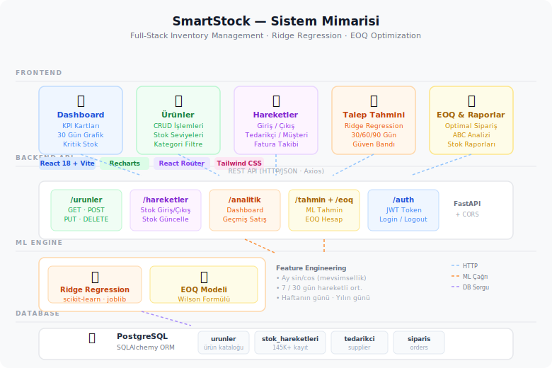

# SmartStock 📦

**Full-stack inventory management system with Ridge Regression demand forecasting and EOQ optimization**

> FastAPI · PostgreSQL · React 18 · scikit-learn

---

## Overview

SmartStock is an intelligent stock management application built as a portfolio project. It combines a clean React frontend with a FastAPI backend and an ML engine that forecasts demand using Ridge Regression and calculates optimal order quantities via the EOQ (Wilson) model.

---

## Architecture



---

## Features

**Inventory Management**
- Product catalog with CRUD operations
- Real-time stock level tracking with critical stock alerts
- Stock movement log (inbound / outbound) with supplier and invoice tracking

**Analytics & ML**
- **Demand Forecasting** — Ridge Regression model with seasonal features (sin/cos month encoding, 7-day and 30-day moving averages, day-of-week). Generates 30 / 60 / 90-day forecasts with confidence bands.
- **EOQ Optimization** — Wilson formula-based optimal order quantity calculation, minimizing holding and ordering costs.
- **ABC Analysis** — Classifies products into A / B / C tiers by inventory value.
- **Dashboard** — 30-day Alım/Satış chart, KPI cards (total products, critical stock, stock value, avg. margin).

---

## Tech Stack

| Layer | Technology |
|---|---|
| Frontend | React 18, Vite, Recharts, Tailwind CSS, React Router |
| Backend | FastAPI, SQLAlchemy ORM, Pydantic, JWT Auth |
| ML | scikit-learn (Ridge), pandas, NumPy, joblib |
| Database | PostgreSQL |

---

## Project Structure

```
SmartStock/
├── backend/
│   ├── app/
│   │   ├── main.py           # FastAPI app + CORS + global error handler
│   │   ├── database.py       # SQLAlchemy engine & session
│   │   ├── models/           # ORM models (Urun, StokHareketi, ...)
│   │   ├── routers/          # API endpoints (urunler, hareketler, analitik, auth)
│   │   └── ml/
│   │       ├── tahmin.py     # Ridge Regression demand forecasting
│   │       └── eoq.py        # EOQ / Wilson formula
│   └── requirements.txt
└── frontend/
    └── src/
        ├── pages/
        │   ├── Dashboard.jsx
        │   ├── Urunler.jsx
        │   ├── Hareketler.jsx
        │   └── analitik/
        │       ├── Tahmin.jsx    # Demand forecast UI
        │       ├── EOQ.jsx       # EOQ analysis UI
        │       └── StokRaporlar.jsx
        └── services/
            └── api.js
```

---

## Getting Started

### Prerequisites
- Python 3.11+
- Node.js 18+
- PostgreSQL

### Backend

```bash
cd backend
python -m venv venv
source venv/bin/activate
pip install -r requirements.txt

# Create .env file
echo "DATABASE_URL=postgresql://user@localhost:5432/smartstock" > .env

uvicorn app.main:app --reload
```

### Frontend

```bash
cd frontend
npm install
npm run dev
```

API runs on `http://127.0.0.1:8000` · Frontend on `http://localhost:5173`

---

## ML Model Details

### Ridge Regression (Demand Forecasting)

Features used per training sample:

| Feature | Description |
|---|---|
| `ay_sin`, `ay_cos` | Month encoded as sine/cosine for seasonality |
| `gun_of_week` | Day of week (0–6) |
| `gun_of_year` | Day of year (1–365) |
| `gecmis_7_ort` | 7-day rolling average sales |
| `gecmis_30_ort` | 30-day rolling average sales |

Minimum 30 days of sales history required for ML mode; falls back to moving-average when data is insufficient.

### EOQ (Wilson Formula)

```
EOQ = sqrt(2 × D × S / H)
```

Where D = annual demand, S = ordering cost (₺), H = annual holding cost rate × unit cost.

---

## Screenshots

> Add screenshots to the `screenshots/` folder and they will appear here.

| Dashboard | Demand Forecast | EOQ Analysis |
|---|---|---|
| `screenshots/dashboard.png` | `screenshots/tahmin.png` | `screenshots/eoq.png` |

---

## License

MIT
